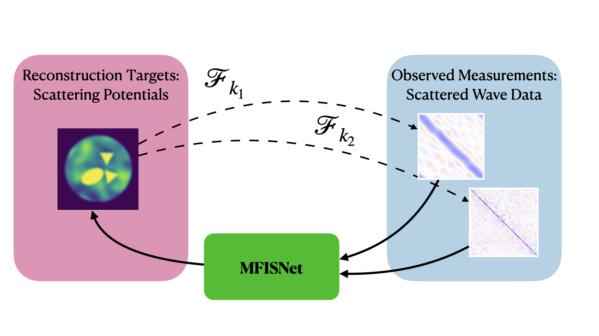
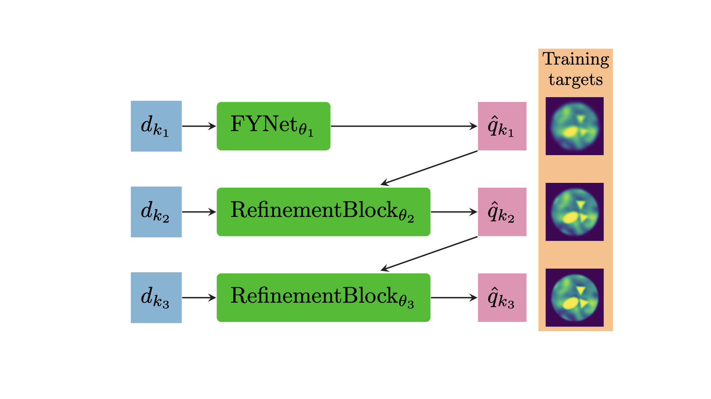
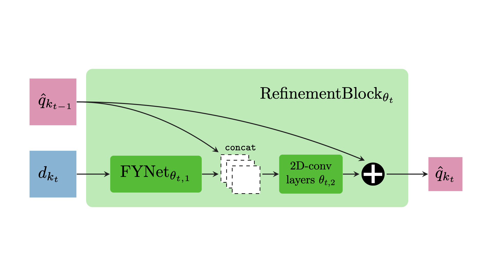

# MFISNets
Experiments for the preprint "Multi-Frequency Progressive Refinement for Learned Inverse Scattering", available on ArXiv [here](https://arxiv.org/abs/2405.13214). 

Written by [Owen Melia](https://people.cs.uchicago.edu/~meliao/), [Olivia Tsang](http://github.com/oortsang), [Vasileios Charisopoulos](https://people.orie.cornell.edu/vc333/), [Yuehaw Khoo](https://www.stat.uchicago.edu/~ykhoo/), [Jeremy Hoskins](http://www.jghoskins.com/) and [Rebecca Willett](https://willett.psd.uchicago.edu/).

This code repository was written jointly by Owen Melia and Olivia Tsang.

Multi-Frequency Inverse Scattering Networks (MFISNets) are designed to solve multi-frequency inverse scattering problems, as depicted below. In these types of problems, the neural network is trained to reconstruct a scattering potential given observations of the forward wave scattering model at multiple frequencies $\{k_1, k_2, ...\}$. We provide code to generate scattering potentials, simulate scattered wave data measurements, and define and train MFISNets.


Our main architecture is MFISNet-Refinement, which is defined by an initial neural network block, followed by a series of refinement blocks. This architecture was loosely inspired by recursive linearization algorithms for inverse scattering, which solve the nonlinear inverse scattering problem via a sequence of easier linear inverse problems. The refinement block for a given sub-problem sharpens the intermediate reconstruction using single-frequency measurements. We train MFISNet-Refinement so each block outputs a blurred version of the ground truth.


Each refinement block is a simple update to a previously-published architecture, FYNet (based on Fan and Ying 2022, "Solving Inverse Wave Scattering with Deep Learning"), which is designed for the single-frequency inverse scattering problem:


## Environment Setup

We provide a description of the environment used for our experiments in `env.yaml`. To use Anaconda to install this environment, you can run:
```
conda env create --name mfisnets --file env.yaml
conda activate mfisnets
```

We performed testing with the following package version numbers:
- jupyter: 1.0.0
- pandas: 2.0.3
- numpy: 1.26.0
- scipy: 1.11.3
- h5py: 3.9.0
- numba: 0.57.1
- matplotlib: 3.7.2
- pytest: 7.4.0
- pytorch: 2.1.0 (with pytorch-cuda version 11.8)
- pip: 23.2.1

Through pip:
- wandb=0.15.12
- cola-ml=0.0.4

To test that the environment is properly set up, you can run the test suite via:
```
python -m pytest test/
```

## Training

We provide sample training scripts for all of our MFISNet variants, including `MFISNet_Refinement`, `MFISNet_Parallel`, and `MFISNet_Fused`. The driver files are located in the root directory, and there are shell scripts in the `training_scripts/` directory. The shell scripts in the `training_scripts/` directory are written with the optimal hyperparameters we found in our experiments.

## Data Generation

We provide sample shell scripts for data generation in `data_generation_scripts/`. These scripts must be run in a particular order; the script generating scattering objects must be run first as the other scripts depend on it. 

The sample scripts generate a small dataset of 50 samples with the following layout:
```
data/
└── dataset/
    ├── scattering_objs/
    │   └── scattering_objs_0.h5
    ├── measurements_nu_1/
    │   └── measurements_0.h5
    ├── measurements_nu_2/
    │   └── measurements_0.h5
    ├── measurements_nu_4/
    │   └── measurements_0.h5
    └── measurements_nu_16/
        └── measurements_0.h5
```

In the data generation code, we often specify the incident wave by its non-angular wavenumber `nu`. A wave with angular wavenumber `k` has non-angular wavenumber `nu = k / (2 * pi)`. `nu` indicates the number of wavelengths that fit in each unit length.


## Dataset

We make the dataset publicly available [at this link](https://uchicago.box.com/s/3fwaiqnhzjzr7y199ezvzxyzsif5jzv6).

Our dataset has the following file structure, and the file reading/writing utilities are written assuming this structure. 

```
data/
└── dataset/
    ├── train_scattering_objs/
    │   └── scattering_objs_*.h5    # Each file has 500 scattering objs
    ├── train_measurements_nu_*/    # We have directories for nu={1,2,4,8,16}, equivalently k={2pi,4pi,8pi,16pi,32pi}
    │   └── measurements_*.h5       # measurements_i.h5 matches with scattering_objs_i.h5
    ├── val_scattering_objs/
    │   └── scattering_objs_*.h5
    ├── val_measurements_nu_*/
    │   └── measurements_*.h5
    ├── test_scattering_objs/
    │   └── scattering_objs_*.h5
    └── test_measurements_nu_*/
        └── measurements_*.h5
```

The scattering object files are saved in hdf5 format, with the following fields:

 * `q_cart`: the scattering potentials sampled on a Cartesian grid.
 * `q_polar`: the scattering potentials sampled on a polar grid.
 * `x_vals`: 1d coordinates of the regular Cartesian grid for the scattering domain
 * `rho_vals`: radius values of the regular polar grid for the scattering domain
 * `theta_vals`: angular values of the regular polar grid for the scattering domain. Also used as the source/receiver directions when generating measurements.
 * `seed`: the RNG seed used when generating this file.
 * `contrast`: the maximum contrast setting.
 * `background_max_freq`: the maximum frequency parameter used when defining the random background part of the scattering potentials.
 * `background_max_radius`: the radius of the disk occupied by the background field.
 * `num_shapes`: how many piecewise-constant shapes were generated.
 * `gaussian_lpf_param`: parameter used to build Gaussian lowpass filter that slightly smooths the scattering potentials.
 * `sample_completion`: array of booleans indicating whether individual samples were generated.
 * `file_completion`: single boolean set to True when the entire generation script is completed.


The measurement files are saved in hdf5 format, with all of the fields in the scattering object files and the following additional fields:

 * `nu_sf`: non-angular wavenumber (in space).
 * `omega_sf`: angular frequency (in time).
 * `q_cart_lpf`: scattering objects transformed by a Gaussian LPF, sampled on the Cartesian grid.
 * `q_polar_lpf`: scattering objects transformed by a Gaussian LPF, sampled on the polar grid.
 * `d_rs`: Measurements of the scattered wave field, in the original (receiver, source) coordinates.
 * `d_mh`: Measurements of the scattered wave field, in the (m, h) coordinates suggested by Fan and Ying, 2022.
 * `m_vals`: Coordinates of the (m, h) transformed data.
 * `h_vals`: Coordinates of the (m, h) transformed data.
 

## Citation

If this code is useful to your research, please cite our preprint:
```
@misc{melia2024mfisnet,
      title={Multi-Frequency Progressive Refinement for Learned Inverse Scattering}, 
      author={Owen Melia and Olivia Tsang and Vasileios Charisopoulos and Yuehaw Khoo and Jeremy Hoskins and Rebecca Willett},
      year={2024},
      eprint={2405.13214},
      archivePrefix={arXiv},
      primaryClass={physics.comp-ph},
      url={https://arxiv.org/abs/2405.13214}, 
}
```
